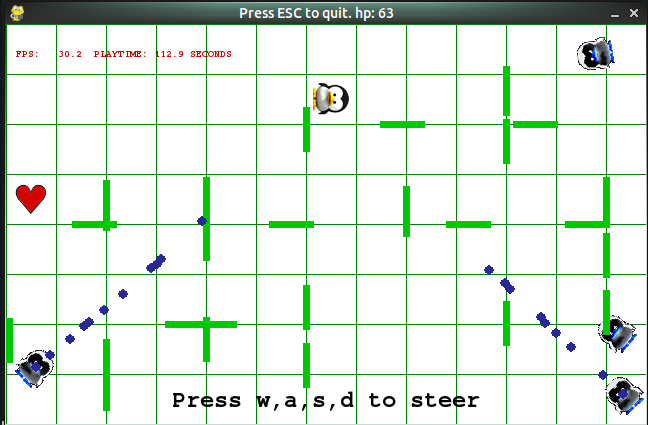
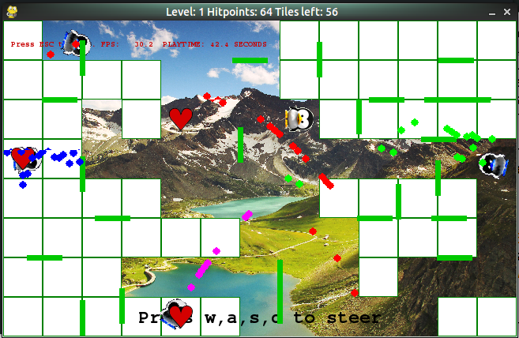

# Crossfiregrid

A game you can play with one hand and one braincell while having a phone call.

Video: https://youtu.be/jS5OeEglXww

a python / pygame game 

tested with: python3.4 as well as python2.7,  pygame 1.9.2a0, on Linux (ubuntu 15.10)

### download

you can either download each file serparate from https://github.com/horstjens/ThePythonGameBook/tree/master/pygame/games/crossfiregrid 
or you just download the file https://github.com/horstjens/ThePythonGameBook/blob/master/pygame/games/crossfiregrid/crossfiregrid.py and create the `data` folder and image files yourself.

The simplest way to download is to download the whole zip archive from https://github.com/horstjens/ThePythonGameBook, extract it and navigate into `pygame/games/crossfiregrid`

### start the game:

  * make sure you have python3 and pygame for python3 or python2.7 and pygame for python2 installed correctly. See pygame documentation or http://askubuntu.com/questions/401342/how-to-download-pygame-in-python3-3
  * python3: type: `python3 crossfiregrid.py`
  * python2: type: `python crossfiregrid.py`
  

### instructions

steer the player by pressing the keys: w,a,s,d

collect hearts to increase your health

avoid the bullets, you only have a limited amount of hitpoints.

you can only move to another tile if no green moving wall is blocking the path

to clear a level, steer the player into all white fields to reveal the background photo. 

### modify the game 

Each new level will show a new photo. You can replace the .jpg pictures in the folder 'data' with your own photos.
Simply put .jpg pictures there. make sure the resolution is as high or higher as your game resolution

You can try out other parameters ( screen resoltion, grid cells etc) by changing the last line. See  in `class PygView()` the method `def __init__()` for a list of accepted parameters

